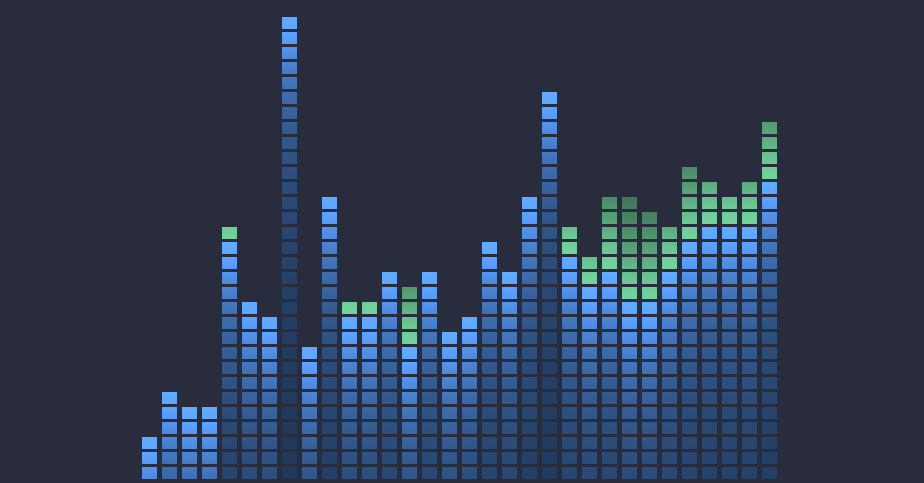

## rtav 
### visualizing music with opengl

### deps
1. GLEW & LibGL - Rendering
2. libSDL2 - Window, Audio, and Inputs
3. libsndfile - Reading audio files. 
> I am only allowing the following audio formats: FLAC, AIFF, MPEG, WAV, OGG
### usage
rtav relative/path/to/directory
## Building
While I am using SDL2 and OpenGL right now the program is only running on linux since it uses dirent to read files. I don't use windows, and this is just a small project for myself so I probably won't add any WinAPI code for handling dirs/paths.
**If you're on linux: This project uses cmake**
> Note: you can pass -DSHADER_DIR="/absolute/path/to/dir" as an option to specify a directory for shader files if needed. Defaults to /usr/local/share/rtav
1. ```git clone https://github.com/Cameron-Ord/rtav && cd rtav```
2. ```cmake -B build && cmake --build build```
3. Move the shader files to the directory (if specified) or do ```sudo mkdir -p /usr/local/share/rtav && cp shader/frag.fs shader/vert.vs /usr/local/share/rtav/``` if left blank
4. Put the binary wherever, but optimally somewhere in your PATH; like /usr/local/bin
